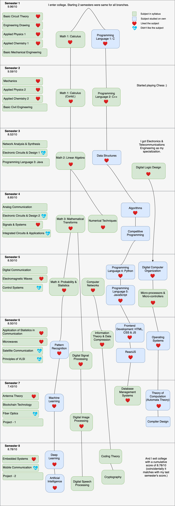

## Engineering in Code

I am redoing my four years of engineering, but this time - by writing code for most of the concepts I learnt back then. _Why!?_ Simply because I feel that there are some subjects from academia which are so important even in professional life, the knowledge which they impart is immensely useful, and I want to understand them thoroughly. **And if I can code something, I have understood it!**

### My Engineering Journey

Let's first see how my engineering journey looks like!

Subjects which are stacked on the left side and don't form the part of the flow aren't much useful to me or my work, although I enjoyed many of them. Reason being that - It's good to know how Mobile Communication, Satellite Communication, Antenna Theory, Microwaves, Fabrication of Integrated Circuits, etc. work, but eventually I cannot leverage this knowledge unless I work in a Space Org, Telecommunication & Networking Org, Hardware Company, etc. 

However, the skills in the flow form the basis and allows one to pick any professional domain. One can use programming today at any place. One can analyse data using Pattern Recognition, ML, AI, etc. at any point. And **to leverage most of the skills mentioned in the flow, all you need is just one computer.**

### More on the Subjects/Skills in the flow

| Subject | Domain | Resources I referred to |
| ------- | ------ | ----------------------- |
| Calculus | Maths | [MIT 18.01 - Single Variable Calculus, Fall 2007 by David Jerison](https://www.youtube.com/playlist?list=PL590CCC2BC5AF3BC1)   [MIT 18.02 - Multi Variable Calculus, Fall 2007 by Dennis Auroux](https://www.youtube.com/playlist?list=PL4C4C8A7D06566F38)   [MIT 18.03 - Differential Equations, Spring 2003 by Arthur Mattuck](https://www.youtube.com/playlist?list=PLEC88901EBADDD980) |
| Linear Algebra | Maths | [MIT 18.06 - Linear Algebra, Fall 2011 by Gilbert Strang](https://www.youtube.com/playlist?list=PL221E2BBF13BECF6C) |
| Probability & Statistics | Maths | [Harvard, Statistics 110: Probability & Statistics](https://www.youtube.com/playlist?list=PL2SOU6wwxB0uwwH80KTQ6ht66KWxbzTIo)   [Book: Probability & Mathematical Statistics by Prasanna Sahoo](https://fsalamri.files.wordpress.com/2015/02/applied-probability-sahoo.pdf)|

