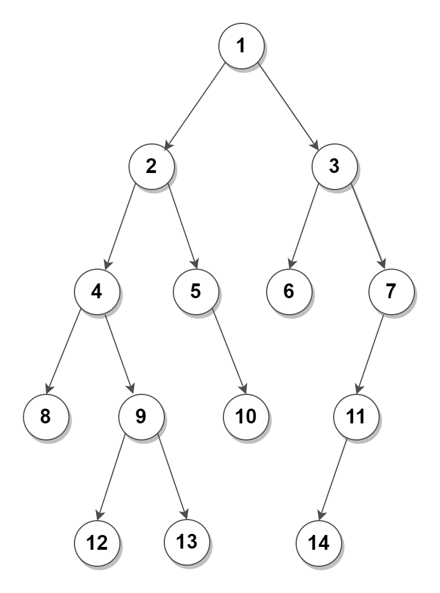

## 05. Binary Trees

In computer science, a *tree* is a widely used abstract data type that represents a hierarchical tree structure with a set of connected nodes. 

Each node in the tree can be connected to many children (depending on the type of tree), but must be connected to exactly one parent, except for the root node, which has no parent. These constraints mean there are no *cycles* or *loops* (no node can be its own ancestor), and also that each child can be treated like the root node of its own subtree, making recursion a useful technique for tree traversal. 

Binary trees are a commonly used type, which constrain the number of children for each parent to exactly two.

In computer science, a binary tree is a tree data structure in which each node has at most two children, which are referred to as *the left child* and *the right child.*

Binary Tree is the first non-linear data structure we are studying. This is going to be a big & important module. 

 

Following is the list of topics related to binary tree. 

| Concept | Description |
| -- | -- |
| [01. Structure & Types of BT](./01_Structure_and_Types.md) | Understand how to describe the structure of BT in code and various types of BT |
| [02. Traversals in BT](./02_Traversals.md) | Understand the two very important traversals in trees - Breadth First Traversal (BFT) and Depth First Traversal (DFT) |
| [03. Recursive Problems on BT](./03_Recursive_problems.md) | Exploit the nature of binary tree to solve most of the problem in a simpler recursive way |
| [04. Insertion & Deletion in BT](./04_Insertion_and_Deletion.md) | How to add and remove nodes from BT | 
| [05. Boundary & Views of BT](./05_Boundaries_and_Views.md) | Understand the concept of boundary of BT and four views of BT |
| [06. Paths & Diameter of BT](./06_Paths_and_Diameter.md) | How to keep track of various paths, from root to leaves, and define the concept of diameter of a BT |
| [07. Least Common Ancestor (LCA)](./07_LCA.md) | Understand the very important concept of LCA and ancestors in general |
| [08. Construction of BT](./08_Construction_of_BT.md) | Understand the various constructional properties of BT |
| [09. Additional Problems](./09_Additional_Problems.md) | Some tricky problems on BT |
