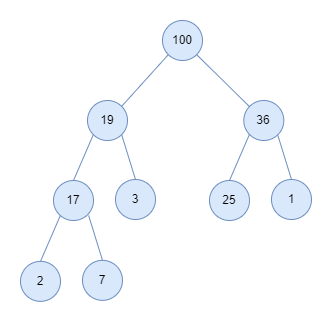

## 07. Heaps

In computer science, a *heap* is a specialized tree-based data structure which is essentially an almost complete tree that satisfies *the heap property*. The property says, in a *max heap*, for any given node C, if P is a *parent node* of C, then the key (the value) of P is greater than or equal to the key of C. In a *min heap*, the key of P is less than or equal to the key of C. The node at the *top* of the heap *(with no parents)* is called the *root node*.

The heap is one maximally efficient implementation of an abstract data type called a *priority queue*, and in fact, priority queues are often referred to as *heaps*, regardless of how they may be implemented. In a heap, the highest (or lowest) priority element is always stored at the root. 

However, a heap is not a sorted structure; it can be regarded as being partially ordered. 

A heap is a useful data structure when it is necessary to repeatedly remove the object with the highest (or lowest) priority, or when insertions need to be interspersed with removals of the root node.

 

Here is the list of topics related to heaps. 

| Concept | Description | 
| -- | -- |
| [01. Implementation](./01_Implementation.md) | Understand the heapify logic and implement the heap |
| [02. Applications of Heaps](./02_Applications.md) | Understand the instances where heaps are useful | 
| [03. Additional Problems](./03_Additional_Problems.md) | Some tricky questions on heaps and priority queues |