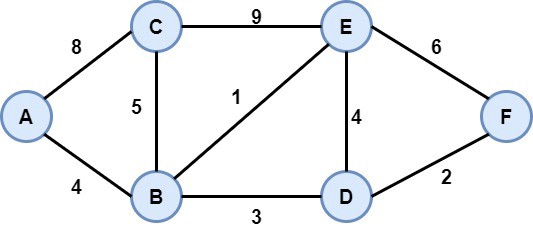

## 08. Graphs

Many real-life problems can be solved by modelling them as a graph problem and using an appropriate graph algorithm. A typical example of a graph is the network of roads and cities in a country, or a network of airports or stations, or a network of friends on social media, etc. Often times, the difficulty lies in detecting that the given problem is actually a graph problem. 

A *graph data structure* consists of a *finite (and possibly mutable)* set of *vertices (also called nodes or points)*, together with a set of unordered pairs of these vertices for an undirected graph or a set of ordered pairs for a directed graph. These pairs are known as *edges (also called links or lines)*, and for a directed graph are also known as *edges* but also sometimes *arrows or arcs.* The vertices may be part of the graph structure, or may be external entities represented by *integer indices or references.* *(Don't worry if the terminology is not clear, we have a whole concept file on it.)*

A graph data structure may also associate to each edge some edge value, such as a symbolic label or a numeric attribute (cost, capacity, length, etc.).

Graphs is the biggest module of all the data structures. There is a separate theory in maths on graphs, known as Graph Theory. With this module, we are not even scratching the surface. 

 

Here is the list of topics related to graphs. 

| Concept | Description |
| -- | -- |
| [01. Terminology & Representation](./01_Term_and_representation.md) | Understand the graph terminology and various methods of representing a graph |
| [02. Traversals](./02_Traversals.md) | Understand the two most important traversal algorithms - BFS (Breadth First Search) & DFS (Depth First Search) |
| [03. Applications of BFS & DFS](./03_Application_of_BFS_and_DFS.md) | Understand how we can use the BFS and DFS to solve various problems like connectivity, bipartiteness, cycles, etc. |
| [04. Union-Find Data Structure](./04_Union_Find_DS.md) | A very specialized data structure which will be useful in the next topic i.e. MST|
| [05. Minimum Spanning Tree (MST)](./05_MST.md) | Understand the concept of minimum spanning trees |
| [06. Shortest Path Algorithms](./06_Shortest_Path_Algos.md) | Understand the famous shortest path algorithms like Dijkstra, Bellman-Ford & Floyd-Warshall |
| [07. Connected Components](./07_Connectivity.md) | Understand the concept of connectivity in more detail by discussing the concepts like articulation points, bridges and strongly connected components |
| [08. Paths in Graph](./08_Paths.md) | Discuss different types of paths like Eulerian Path, Hamiltonian Path, etc. |
| [09. Maximum Flow Problem](./09_Flow.md) | Understand the flow problem and its solution using Ford-Fulkerson algorithm | 
| [10. Advanced Concepts](./10_Advanced.md) | Here we will talk about some advanced graph concepts like 2SAT problem, path covers, etc. |

