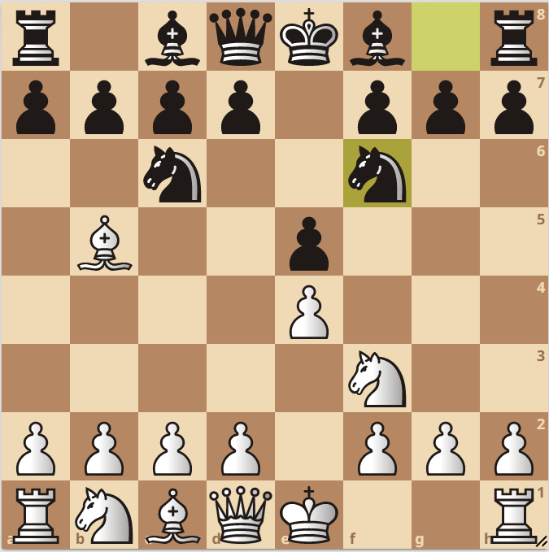

## Data Structures

### Introduction

Let me ask the most fundamental question, _What is data?_ Exactly! What it is. _How does it differ from information?_ If I have to define the relation between the two, I would say, **Information= Data + Context**. Let me explain what I mean by that. 

Suppose I send you the number 23 as a text message on your phone. You would not understand what I meant by it, would you? This '23' number is a data. It is data, but provides no information. But if I send you, 'I am 23 years old', now you get the information about my age. Similarly, if I send you [23, 22, 24, 28, 21, ..., 23], you will not understand what does this data mean. But if I give you the context, that it is age of all the students in the classroom; now it makes sense to you. 

I can give you a string like *"r1bqkb1r/pppp1ppp/2n2n2/1B2p3/4P3/5N2/PPPP1PPP/RNBQK2R w KQkq - 4 4"*, it won't make sense to you. But I tell you that this is a FEN representation of a position on the chess board and teach you how to read it and make one by looking at some random position on the chessboard, you will understand this string. For instance, the above mentioned string actually represents the following position: 

 

Consider this example, [(1, 2), (3, 4), (-2, -3), (0, 5)] are 4 points on the plane. Can you find the center and the radius of the circle such that all 4 points should lie on or within the circle & the area of that circle should be minimum? You can only perform meaningful operations on the points given to you, if you have the context of what needs to be done. 

Now, if I set the context aside for a moment and just give you tons of data, astronomical sized sequence of numbers or strings; and ask you to perform different kinds of operations on it, the million dollar question here would be, *how can I perform those operations in the most efficient way?* Sometimes the efficiency will be related to memory and most of the times it will be related to time. Consume less memory. Consume less time. The lesser the better. 

To achieve this efficiency, we can't just dump all the data in one serial order i.e. put the items one after another, and go back and forth between the items again and again. We need to come with smarter storage strategies and access strategies, so that we can perform a given operation in the fastest way possible. 

> **Definition:** In computer science, a data structure is a data organization, management, and storage format that is usually chosen for efficient access to data. More precisely, a data structure is a collection of data values, the relationships among them, and the functions or operations that can be applied to the data, i.e., it is an algebraic structure about data. 

Even if you do not understand this technical definition, it is completely fine. You can always come back to it once you have learnt a couple of data structures. 

### Abstract Data Types (ADTs)

When I say you this 'X' is a data structure, you treat X like a black-box. The user of this data structure doesn't need to know the internal details about it. Of course, the maker of the data structure would definitely need to know all the implementation details. But for the user, it's not the case. 

User treats any data structure like a black-box called Abstract Data Type (ADT). ADT means just like any other data type in a programming language which is used to store some data, for example - int, float, string, double, etc., this data structure is also a data type and is abstract, that means - the internal implementation details are not known. What user cares about is - 

* In what format the data needs to be fed to this data structure?
* What all operations I can peform on it?
* And what will be the output of those operations?

How was the output generated, how were those operations performed, how was data stored internally in the data structure - that is none of user's business!

 

However, in this course we are the makers of various data structures for the better or the worse. Hence, it is our duty to dive deep into each one of them to understand the implementation details. 

I have divided this course into 10 modules. You can find the detail of each module within the respective folders. 

| Modules | 
|-------- |
| 01. Arrays |
| 02. Linked Lists |
| 03. Stacks |
| 04. Queues |
| 05. Binary Trees |
| 06. Binary Search Trees |
| 07. Heaps |
| 08. Graphs |
| 09. HashTables |
| 10. Miscellaneous *(not a data structure)*|

Enjoy Learning!

